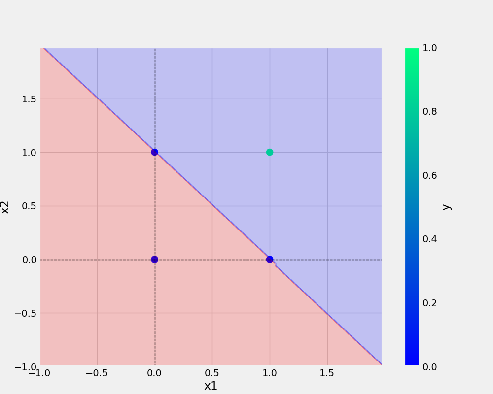

# oneNeuron
Perceptron Implementation

# Add url
[Git handbook](https://guides.github.com/introduction/git-handbook/)

# Add image


# Add python code type 3 back tick
```Python

def predict(self, X):
    X_with_bias = np.c_[X, -np.ones((len(X), 1))]
    return self.activationFunction(X_with_bias, self.weights)


```

## To show table

x1 |x2 | y
-|-|-
0|0|0
0|1|0
1|0|0
1|1|1


